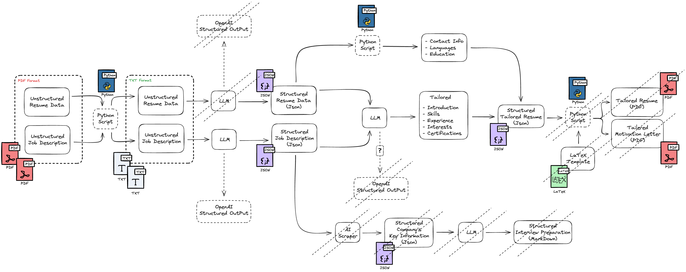

# Auto-Resume: Tailored CV & Motivation Letter Generator

This project automates the process of tailoring a CV and motivation letter for specific job descriptions using large language models (LLMs) and LaTeX for high-quality PDF formatting. The system takes unstructured resume data and job descriptions, structures them using an LLM, and then tailors them into a customized resume and motivation letter in PDF format.

## Features

- **LLM-powered processing**: Utilizes large language models to convert unstructured job descriptions and resume data into structured JSON formats.
- **Custom-tailored outputs**: Produces both a tailored resume and a tailored motivation letter, based on the job description.
- **PDF generation**: Outputs are formatted as professional PDFs using LaTeX templates.
- **Python automation**: Handles JSON processing and LaTeX PDF generation with Python scripts.
- **Prompt engineering**: Includes prompt design and optimization for both job description parsing and resume tailoring.
- **Pydantic modeling**: Ensures structured and validated output using Pydantic models to interact with the LLM and validate the JSON output.

## System Architecture

1. **Input**: Unstructured resume data and job description text.
2. **LLM**: Large Language Model processes both inputs and converts them into structured JSON formats.
3. **Tailoring**: The LLM tailors the resume based on the job description.
4. **Python Script**: Processes the structured JSON to generate PDFs for both the resume and motivation letter using LaTeX templates.
5. **Output**: Tailored resume and motivation letter in PDF format.

### Workflow

1. **Step 1**: Parse unstructured resume and job description data with LLM.
2. **Step 2**: Generate structured JSON for both the resume and job description using LLM and Pydantic models.
3. **Step 3**: Use the LLM to tailor the resume to fit the job description.
4. **Step 4**: A Python script reads the JSON data and applies the LaTeX template to generate the final tailored resume and motivation letter PDFs.


## Project Architecture


*Figure 1: Auto-Resume Project Architecture Diagram*

## Project Structure

```bash
auto-resume/
│
├── data/
│   ├── resume_data/
│   │   ├── raw/
│   │   │   ├── resume.txt
│   │   └── structured/
│   │       └── resume.json
│   └── job_descriptions/
│       ├── raw/
│       │   └── job_description.txt
│       └── structured/
│           └── job_description.json
│
├── src/
│   ├── scripts/
│   │   ├── process_resume.py
│   │   ├── process_job.py
│   │   ├── tailor_resume.py
│   │   └── generate_pdf.py
│   ├── models/
│   │   ├── resume_model.py
│   │   ├── job_model.py
│   │   ├── tailor_model.py
│   │   └── llm_model.py
│   ├── service/
│   │   └── client.py
│   └── prompts/
│       ├── job_prompts.py
│       ├── resume_prompts.py
│       └── tailoring_prompts.py
│
├── templates/
│   └── latex/
│       ├── template_1/
│       │   ├── resume.tex
│       │   └── letter.tex
│       └── template_2/
│           ├── resume.tex
│           └── letter.tex
│
├── outputs/
│   ├── resumes/
│   │   ├── tailored_resume.pdf
│   └── letters/
│       └── tailored_motivation_letter.pdf
│
├── README.md
└── requirements.txt
```

## Requirements

- Python 3.x
- LaTeX distribution (for generating PDFs)
- OpenAI (or another LLM provider) API access
- Required Python libraries:
  - `openai`
  - `json`
  - `pydantic`
  - `os`
  - `subprocess`

To install the required libraries, run:

```bash
pip install -r requirements.txt
```

## Usage

### 0. Convert PDF to TXT

Prepare the data in the `data/` directory.  

Run the script to convert the PDF files to TXT files:

```bash
python scripts/parse_pdf.py data/resume.pdf
python scripts/parse_pdf.py data/job_description.pdf
```

### 1. Process the Resume and Job Description

Run the script to process the unstructured TXT files into structured JSON format:

```bash
python scripts/process_resume.py data/resume.txt
python scripts/process_job.py data/job_description.txt
```

### 2. Tailor the Resume

Use the LLM to tailor the resume based on the job description:

```bash
python scripts/tailor_resume.py
```

### 3. Build the LaTeX

Run the script to build the LaTeX files:

```bash
python scripts/build_latex_pdf.py
```

### 4. Generate the PDFs

Finally, generate the tailored resume and motivation letter in PDF format:

```bash
python scripts/generate_pdf.py
```
